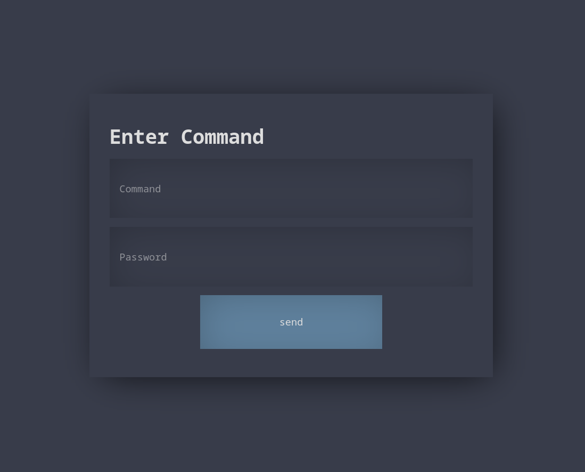

# homeautomation

Homeautomation is a blazingly fast lightweight framework for relaying end-to-end encrypted commands
and handling email authentication.

## preview


### run
```shell
$ cargo run
   Compiling raspi_backend v0.1.0 (homeautomation/raspi_backend)
    Finished dev [unoptimized + debuginfo] target(s) in 1.62s
     Running `target/debug/raspi_backend`
[LOG] received new command 1655300494: open garage
[LOG] generated identifier S3E8qn6EF4 and check_code: B4tEnmeiVo
[LOG] validated command: open garage
open garage
```

The LOG is written to `stderr` so the commands can be piped to another program
like so:

```shell
$ ./raspi_backend 2>homeautomation.log | other
```

## structure
```
                            -------------server--------------
                            |                               |       -----raspi-backend-----
                            | out: lists all encrypted      |       | decrypts commands    |
---web-interface---         |      commands                 |<------| with PSK1 and checks |
|   clientside    |         |                               |       | for prefix. For PSK2 |
|   encrypting    |    ---->| confirm: receives and writes  |       | this check fails.    |
|   with PSK1     |    |    |          a pair of identifier |       |                      |
-------------------    |    |          and check_code to    |       | generates pair of    |
                       |    |          database             |       | identifier and       |
                       |    |                               |   ----| check_code for each  |
---web-interface---    |    | confirm_out: lists all the    |   |   | command and sends an |
|   clientside    |    |    |              received pairs   |   |   | email to predefined  |
|   encrypting    |    |    ---------------------------------   |   | address              |
|   with PSK2     |    |                                        |   |                      |
-------------------    |    -----------email-inbox----------    |   | checks confirm_out   |
                       |    | receiving emails with links  |    |   | for valid confirm    |
                       -----| to server/confirm containing |<----   | pairs                |
                            | identifier and check_code    |        ------------------------
                            --------------------------------
```

## configuration

in `raspi_backend/src/main.rs` edit the configuration section

```rust
static CMD_PASSWORD: &str = "secret"; //the AES key the commands are end-to-end encrypted with
static EMAIL_ADDR: &str = "user@example.com";
static EMAIL_BIN: &str = "neomutt"; //or mailx e.g.
static BASE_URL: &str = "https://home.example.com/";

static HTTP_USER: &str = "automatipi"; //set in .htacces for example
static HTTP_PASS: &str = "secret";

static REFRESH_DELAY: Duration = Duration::from_secs(10);
```

NOTE: It is recommended to setup at least a HTTP Basic Authentication for the webserver as there is
no spam/bruteforce detection in this pretty much Proof of Concept implementation.
